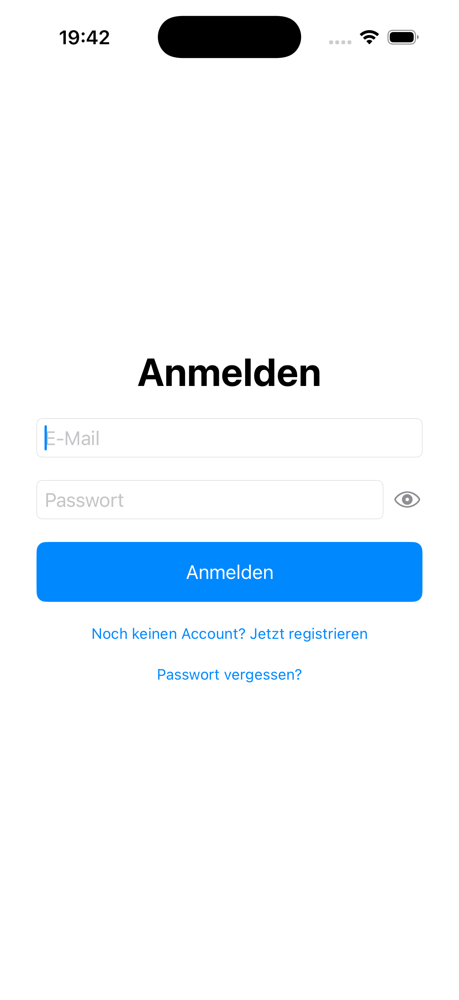
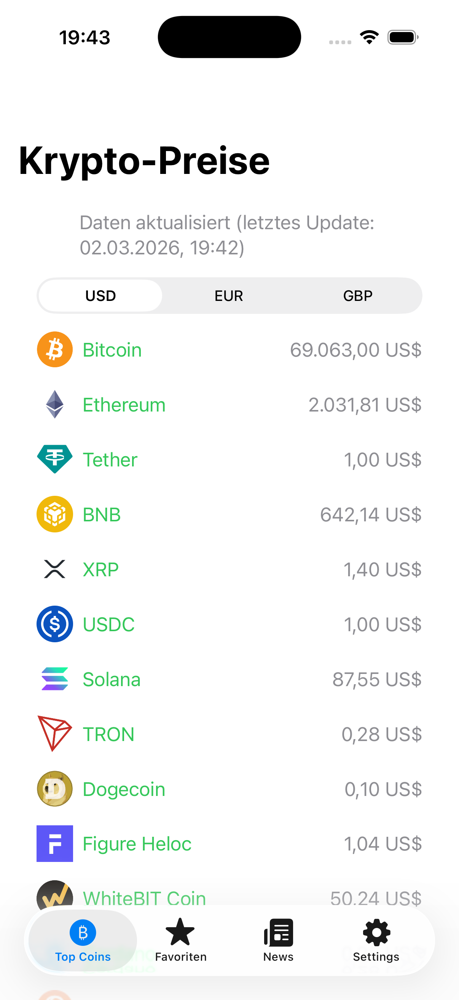
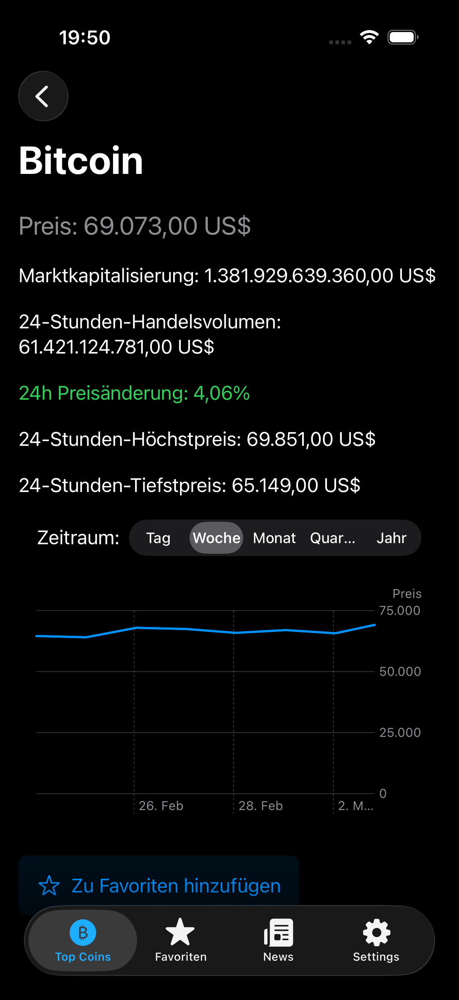
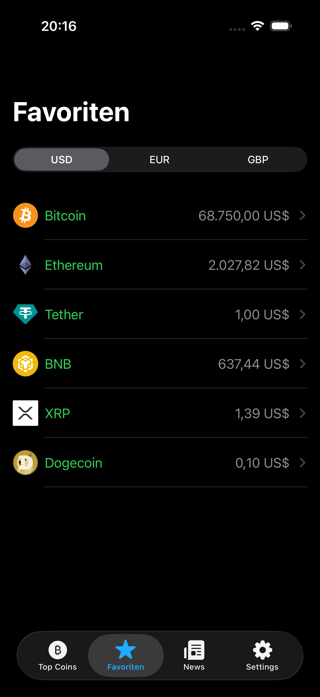
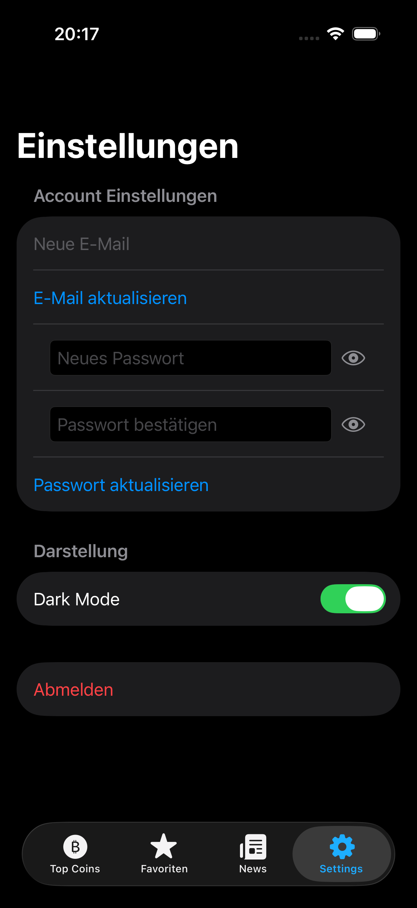
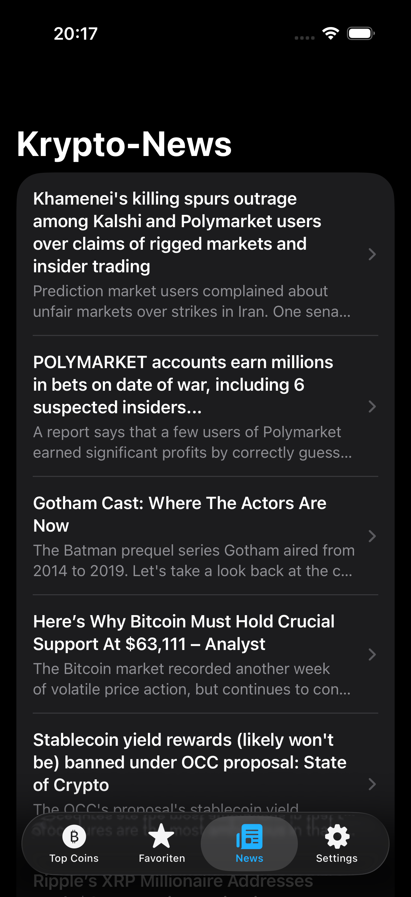
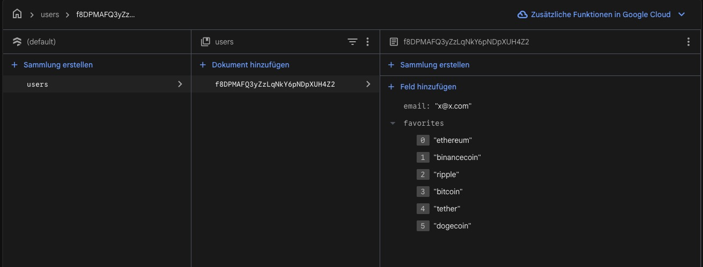

# CryptoTracker

CryptoTracker ist eine native iOS-App zur Beobachtung von Kryptowährungen, Marktwerten und historischen Preisverläufen. Angemeldete Nutzer können persönliche Favoriten geräteübergreifend speichern. Markt- und Chartdaten werden lokal mit SwiftData zwischengespeichert, damit zuletzt geladene Informationen auch bei Netzwerk- oder API-Problemen verfügbar bleiben.

> Portfolio-Projekt von Michael Winkler · Jchillah’s Design & Coding Forge

## Projektstatus

**Release Candidate für iOS.** Der Quellcode enthält eine reproduzierbare CI-Buildprüfung, sichere Firestore-Regeln, Account-Löschung in der App und eine dokumentierte Release-Checkliste. Für eine App-Store-Veröffentlichung müssen noch die eigene Firebase-Konfiguration, das Apple-Developer-Team, App-Store-Metadaten und ein abschließender Geräte-/TestFlight-Test eingerichtet werden.

- Kanonisches Repository: `jchillah/CryptoTracker`
- Organisationsspiegel: `Jchillah-s-Coding-Forge/CryptoTracker`
- Pitchdeck: https://jchillah.github.io/cryptotracker-pitchdeck/

## Funktionen

- Aktuelle Preise, Marktkapitalisierung und 24-Stunden-Marktdaten über CoinGecko
- USD-, EUR- und GBP-Darstellung
- Historische Preisverläufe mit Swift Charts
- Firebase Authentication für Registrierung, Anmeldung und Passwort-Reset
- Nutzerbezogene Favoriten und Darstellungseinstellungen in Firestore
- Lokaler Offline-Fallback für Markt- und Chartdaten mit SwiftData
- Krypto-News über einen schlüsselfreien RSS-Feed
- Dark Mode, Pull-to-Refresh und verständliche Lade-, Leer- und Fehlerzustände
- E-Mail-/Passwortverwaltung, Abmeldung und Account-Löschung

## Screenshots

<p align="center">
  
  
  
  
  <br />
  
  
  
</p>

## Tech Stack

| Bereich | Technologie |
|---|---|
| Sprache und UI | Swift, SwiftUI, Swift Charts |
| Architektur | MVVM, Repository Pattern, expliziter View-State |
| Nebenläufigkeit | Swift Concurrency (`async`/`await`, `Task`) |
| Netzwerk | URLSession, REST, RSS/XML |
| Cloud | Firebase Authentication, Cloud Firestore |
| Lokale Daten | SwiftData |
| Abhängigkeiten | Swift Package Manager |
| Qualität | GitHub Actions, Xcode Build, Firestore Rules |

## Architektur

CryptoTracker verwendet bewusst **MVVM** statt eines unnötig komplexen MVVM/MVI-Hybrids:

```text
SwiftUI Views
    ↓ Nutzeraktionen / beobachtbarer Zustand
ViewModels
    ↓ Anwendungslogik
Services und Repositories
    ↓
CoinGecko · RSS · Firebase Auth · Firestore · SwiftData
```

- **Views** stellen Zustand dar und leiten Nutzeraktionen weiter.
- **ViewModels** verwalten Lade-, Daten- und Fehlerzustände.
- **Services** kapseln Netzwerkzugriffe und lokale Persistenz.
- **Repositories** kapseln nutzerbezogene Firestore-Daten.
- **SwiftData** dient als Offline-Fallback und wird nach Coin beziehungsweise Währung getrennt verwaltet.

Ein MVI-Anteil wäre erst sinnvoll, wenn komplexe Such-, Filter-, Undo-/Redo- oder mehrstufige Interaktionsflüsse hinzukommen.

## Projektstruktur

```text
CryptoTracker/
├── CryptoTrackerApp.swift
├── Models/
├── Repositories/
├── Services/
├── Utils/
├── ViewModels/
└── Views/

.github/workflows/ios-ci.yml
firestore.rules
firebase.json
PRIVACY.md
RELEASE_CHECKLIST.md
```

## Lokale Einrichtung

### Voraussetzungen

- macOS mit einer aktuellen Xcode-Version
- iOS 18.2 oder neuer als aktuelles Deployment Target
- Apple-Developer-Team für Geräte- und App-Store-Builds
- eigenes Firebase-Projekt

### 1. Repository klonen

```bash
git clone https://github.com/jchillah/CryptoTracker.git
cd CryptoTracker
open CryptoTracker.xcodeproj
```

### 2. Firebase konfigurieren

1. In der Firebase Console eine iOS-App mit dem Bundle Identifier des Xcode-Targets registrieren.
2. `GoogleService-Info.plist` herunterladen.
3. Die Datei lokal in den Ordner `CryptoTracker/` ziehen und dem App-Target zuordnen.
4. In Firebase Authentication **E-Mail/Passwort** aktivieren.
5. Firestore erstellen und die Regeln aus `firestore.rules` veröffentlichen:

```bash
firebase deploy --only firestore:rules
```

`GoogleService-Info.plist`, Zertifikate und Provisioning-Profile werden absichtlich nicht versioniert.

### 3. App starten

1. Swift-Package-Abhängigkeiten in Xcode auflösen lassen.
2. Simulator oder Testgerät auswählen.
3. App mit **Run** starten.

Für öffentliche CoinGecko-Endpunkte und den RSS-Newsfeed ist kein im Client gespeicherter API-Schlüssel erforderlich.

## Sicherheit und Datenschutz

- Firestore-Zugriffe sind auf den angemeldeten Eigentümer des jeweiligen `users/{uid}`-Dokuments beschränkt.
- Zulässige Firestore-Felder und Datentypen werden serverseitig validiert.
- Zertifikate, Provisioning-Profile und Firebase-Konfigurationen werden durch `.gitignore` ausgeschlossen.
- Der Nutzer kann seinen Account direkt in der App löschen.
- Datenschutzinformationen stehen in [PRIVACY.md](PRIVACY.md).

Vor dem Release müssen Firebase App Check, API-/Bundle-Restriktionen und die App-Store-Datenschutzangaben im jeweiligen Produktivprojekt geprüft werden.

## Qualitätssicherung

Die GitHub-Action `.github/workflows/ios-ci.yml`:

- lehnt versehentlich eingecheckte Firebase-, Zertifikats- und Provisioning-Dateien ab,
- löst Swift-Package-Abhängigkeiten reproduzierbar auf,
- baut das App-Scheme für einen generischen iOS-Simulator ohne Code Signing.

Die vollständigen manuellen Freigabeschritte stehen in [RELEASE_CHECKLIST.md](RELEASE_CHECKLIST.md).

## Datenquellen

- CoinGecko API für Markt- und Chartdaten
- CoinDesk RSS für Krypto-News
- Firebase Authentication und Firestore für Nutzerkonten, Favoriten und Einstellungen

CryptoTracker ist kein Finanzberatungsprodukt. Kurs- und Nachrichtendaten können verzögert, unvollständig oder vorübergehend nicht verfügbar sein.

## Lizenz

Dieses Projekt ist proprietär. Alle Rechte sind vorbehalten. Eine Nutzung, Weitergabe oder Wiederveröffentlichung des Codes außerhalb der ausdrücklich erlaubten GitHub-Funktionen bedarf der schriftlichen Zustimmung des Autors.

## Kontakt

Michael Winkler  
Jchillah’s Design & Coding Forge  
E-Mail: Michael.Winkler.Developer@gmail.com
